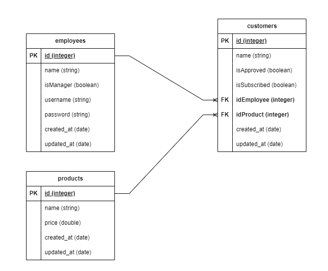

# PT Smart

## Instalasi awal docker, migrasi dan seeding data (menggunakan docker)

### 1. Membuat container docker dan menjalankannya
pertama pastikan docker sudah berjalan lalu buka folder crm dengan mengetikan command ```cd crm``` pada terminal/command prompt lalu ketikan perintah di bawah ini:
```json
docker-compose up --build
```
### 2. Migrasi data
```json
docker compose exec app php artisan migrate
```
### 3. Seeding data
```json
docker compose exec app php artisan db:seed
```
#### jika menggunakan docker, laravel berjalan pada port 80, lalu untuk koneksi database postgres dengan dbeaver atau table plus gunakan port 6545

&nbsp;

## Migrasi dan seeding data (tidak menggunakan docker)
Untuk database pada postgres diberi nama ```ptsmart```
### 1. Migrasi data
```json
php artisan migrate
```

### 2. Seeding data
```json
php artisan db:seed
```
&nbsp;

## Username dan password untuk login
```json
username: johndoe
password: password123
```
## ERD

